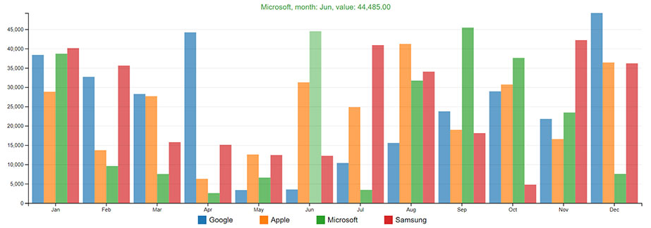
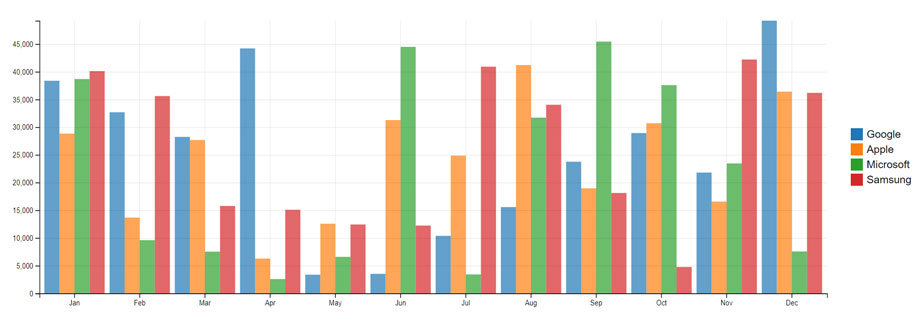
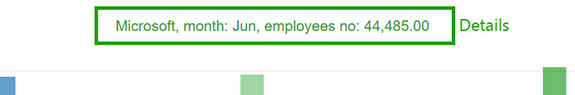
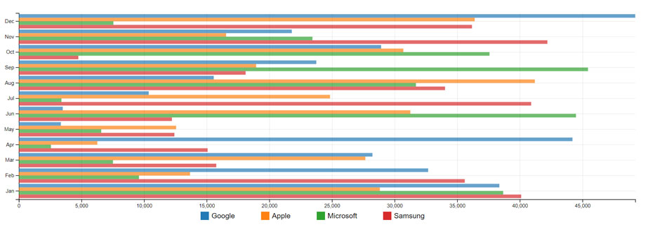

# Animated bar chart - jQuery plugin
  [](https://github.com/vnidev/animated-bar-chart/issues) [](http://inch-ci.org/github/vnidev/animated-bar-chart)

jQuery plugin for rendering animated bar charts using [jQuery](https://jquery.com/) and [D3.js](https://d3js.org/) library.

## Table of Contents

* [About](#about)
* [Download and Install](#download-and-install)
* [Quick Start](#quick-start)
* [Documentation](#documentation)
* [Updating chart](#updating-chart)
* [Changelog](#changelog)
* [To be done](#to-be-done)

## About


My goal is to keep this plugin light and simple to use. I'm not planning to implement all of D3.js library features into it. There is a source in src folder, so feel free to experiment with code. You can find some examples with different settings in examples folder. For the complete list of options see [Documentation](#documentation) section.

## Download and install
You need to include D3.js, jQuery and bar chart libraries. For D3 and jQuery, visit their web sites or include scripts in your head tag. Copy dist folder to your project and include:

```html
<link rel="stylesheet" href="./dist/bar.chart.min.css" />

<script src='https://code.jquery.com/jquery-3.3.1.min.js'></script>
<script src='https://d3js.org/d3.v4.min.js'></script>
<script src="./dist/jquery.bar.chart.min.js"></script>
```

## Quick start
Add div container to your body tag:
```html
<div id="chtAnimatedBarChart" class="bcBar"></div>
```

You need to prepare data for the chart:
```javascript
var chart_data = [
{ "group_name": "Google", "name": "Jan", "value": 26037 },
{ "group_name": "Google", "name": "Feb", "value": 8597 },
{ "group_name": "Apple", "name": "Jan", "value": 33102 },
{ "group_name": "Apple", "name": "Feb", "value": 43426 },
...
]
```

Then you need to initialize the chart:
```javascript
$('#chtAnimatedBarChart').animatedBarChart({ data: chart_data });
```

## Documentation
There is a few options that can be used to customize the look of the chart. Configuration of the chart can be done by passing the options you want to define into the animatedBarChart constructor as an object. For example:
```javascript
$('#chtAnimatedBarChart').animatedBarChart({
   data: chart_data,
   chart_height: 200,
   show_legend: false,
   ...
});
```

#### List of available options

#### option: data - type: array of objects
Default [].

Data that will be used for chart rendering. You need to have 3 properties in every object of data array:
* **group_name** - this property is used for data grouping and for the legend,
* **name** - this property is used for x axis,
* **value** - this property is used for y axis.


Example:
```javascript
{ "group_name": "Google", "name": "Jan", "value": 26037 },
{ "group_name": "Google", "name": "Feb", "value": 8597 },
...
```
---
#### option: params - type: object
Properties:
* **group_name** - default: 'group_name', type: string,
* **name** - default: 'name', type: string,
* **value**: default: 'value', type: string.

You can customize which properties from your data will be rendered.

Usage: if your data is in format:
```javascript
{ "company": "Google", "month": "Jan", "employees_no": 26037 },
{ "company": "Google", "month": "Feb", "employees_no": 8597 },
...
```
You can set default options to:
```javascript
$('#chtAnimatedBarChart').animatedBarChart({
   data: chart_data,
   params: {
      group_name: 'company',
      name: 'month',
      value: 'employees_no'
   }
});
```
---
#### option: chart_height - type: number
Default value is **400**. Height of the chart in pixels.

Usage:
```javascript
$('#chtAnimatedBarChart').animatedBarChart({
   data: chart_data,
   chart_height: 200
});
```
---
#### option: colors - type: array
Default value is **null**. There is already 10 predefined colors that will be used for different groups. You can override this setting by defining your own colors.

Usage:
```javascript
$('#chtAnimatedBarChart').animatedBarChart({
   data: chart_data,
   colors: ['red', 'blue', 'lime', ...] or ['#f44242', '#0048ff', '#04ff00', ...]
});
```
---
#### option: show_legend - type: boolean
Default value is **true**. Chart legend will be automatically generated below chart with your **group_name** values. You can hide legend by sending **false** through show legend option.


Usage:
```javascript
$('#chtAnimatedBarChart').animatedBarChart({
   data: chart_data,
   show_legend: false
});
```
---
#### option: legend - type: object
Default legend settings. Properties:
* **position** - default: LegendPosition.bottom, type: enum - default legend position (LegendPosition.top, LegendPosition.bottom, LegendPosition.left, LegendPosition.right),
* **width** - default: 200, type: number - default legend width in pixels for left or right legend position.



Usage:
```javascript
$('#chtAnimatedBarChart').animatedBarChart({
   data: chart_data,
   legend: {
      position: LegendPosition.right,
      width: 150
   }
});
```
---
#### option: x_grid_lines - type: boolean
Default value is **true**. Display horizontal grid lines. You can hide horizontal grid lines by sending **false** through this option.

Usage:
```javascript
$('#chtAnimatedBarChart').animatedBarChart({
   data: chart_data,
   x_grid_lines: false
});
```
---
#### option: y_grid_lines - type: boolean
Default value is **true**. Display vertical grid lines. You can hide vertical grid lines by sending **false** through this option.

Usage:
```javascript
$('#chtAnimatedBarChart').animatedBarChart({
   data: chart_data,
   y_grid_lines: false
});
```
---
#### option: tweenDuration - type: int
Default value is **300**. Speed of bar animation in milliseconds.

Usage:
```javascript
$('#chtAnimatedBarChart').animatedBarChart({
   data: chart_data,
   tweenDuration: 1000
});
```
---
#### option: bars - type: object
Default bar settings. Properties:
* **padding** - default: 0.075, type: number - default bar group padding,
* **opacity** - default: 0.7, type: number - default bar opacity,
* **opacity_hover**: default: 0.45, type: number - default bar opacity on mouse hover,
* **disable_hover**: default: false, type: boolean - disable details on mouse hover,
* **hover_name_text**: default: 'name', type: string - text for x axis value in details,
* **hover_value_text**: default: 'value', type: string- text for y axis value in details.



Usage:
```javascript
$('#chtAnimatedBarChart').animatedBarChart({
   data: chart_data,
   bars: {
      padding: 0.1,
      opacity: 0.5,
      opacity_hover: 0.1,
      disable_hover: true,
      hover_name_text: 'month',
      hover_value_text: 'employees no'
   }
});
```
---
#### option: number_format - type: object
Default format for numbers. Properties:
* **format** - default: ',.2f', type: string - default chart number format,
* **decimal** - default: '.', type: number - default symbol for the decimal separator,
* **thousands**: default: ',', type: number - default symbol for the thousands separator,
* **grouping**: default: [3], type: object - default character grouping,
* **currency**: default: ['$'], type: object - default currency symbol.

For more about formats, see [D3.js](https://d3js.org/) documentation.

Usage:
```javascript
$('#chtAnimatedBarChart').animatedBarChart({
   data: chart_data,
   number_format: {
      format: ',.4f',
      decimal: ',',
      thousands: '.',
      grouping: [2],
      currency: ['€']
   }
});
```
---
#### option: margin - type: object
Default chart margins. Properties:
* **top** - default: 0, type: number - default chart top margin,
* **right** - default: 35, type: number - default chart right margin,
* **bottom**: default: 20, type: number - default chart bottom margin,
* **left**: default: 70, type: number - default chart left margin.

Usage:
```javascript
$('#chtAnimatedBarChart').animatedBarChart({
   data: chart_data,
   margin: {
      top: 100,
      right: 100,
      bottom: 100,
      left: 100
   }
});
```
---
#### option: rotate_x_axis_labels - type: object
With this setting, chart will automatically rotate x axis labels when screen resolution is less then minimun_resolution property.

Properties:
* **process** - default: true, type: boolean - disable automatically labels rotation,
* **minimun_resolution** - default: 720, type: number - minimum resolution for labels rotation,
* **bottom_margin**: default: 15, type: number - label bottom margin,
* **rotating_angle**: default: 90, type: number - label rotating angle,
* **x_position**: default: 9, type: number - label x position,
* **y_position**: default: -3, type: number - label y position,


Usage:
```javascript
$('#chtAnimatedBarChart').animatedBarChart({
   data: chart_data,
   rotate_x_axis_labels: {
      process: false,
      minimun_resolution: 500,
      bottom_margin: 30,
      rotating_angle: 45,
      x_position: 10,
      y_position: 0
   }
});
```
---
#### option: horizontal_bars - type: boolean
Default value is **false**. With this setting, you can change default vertical to horizontal orientation.



Usage:
```javascript
var chart_data = getData();
chart = $('#chtAnimatedBarChart').animatedBarChart({
   data: chart_data,
   horizontal_bars: true
});
```

## Updating chart
You can update chart data by calling updateChart function. See **filter_data_example.html** from examples folder.

Usage:
First, you need to initialize the chart:
```javascript
var chart = $('#chtAnimatedBarChart').animatedBarChart({
   data: chart_data,
   ...
});
```
Then you need to call updateChart function with new data and options:
```javascript
chart.updateChart({ data: new_chart_data });
```

## Changelog
###### v1.2
* Set legend position (option: legend: { position: LegendPosition.right, width: 200 }), look at right legend example (examples/right_legend_example.html),
* Add resposive styles for the legend,
* Bug Fixes.

###### v1.1
* Horizontal bar orientation (option: horizontal_bars, default: false), look at horizontal bar example (examples/horizontal_example.html),
* Code optimization,
* Fixed legend overlapping.

## To be done
* ~~Chart orientation (horizontal/vertical bars)~~,
* ~~Legend position~~,
* Display values on bars,
* ...
